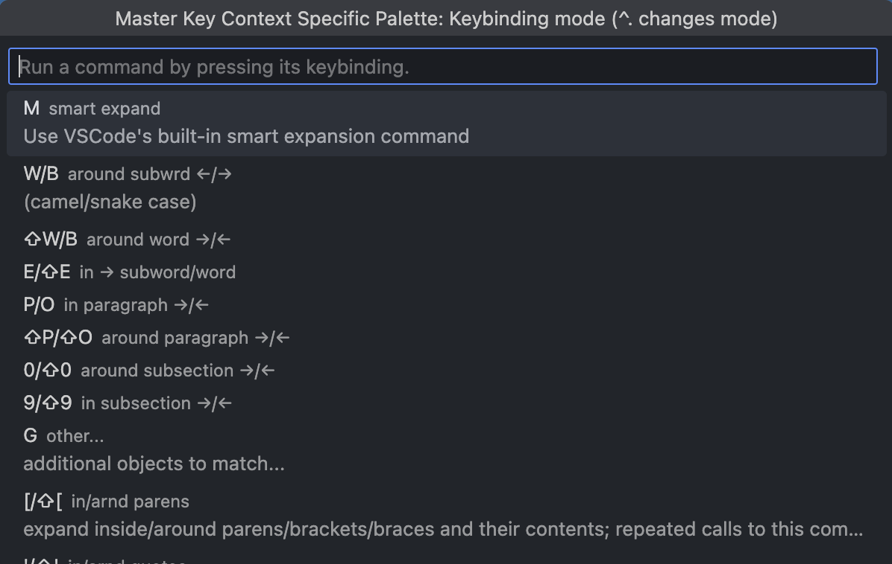

<!--NOTE: `width: 1.75em` appears to be ignored when the file is displayed in the github repo -->
<h1>aster Key</h1>

[](https://www.repostatus.org/#active)
[](https://github.com/haberdashPI/vscode-master-key/actions/workflows/ci.yml)
[](https://codecov.io/gh/haberdashPI/vscode-master-key)
[](https://github.com/google/gts)
[](https://haberdashpi.github.io/vscode-master-key)

Master key helps you to learn, create and use powerful keybindings in [VSCode](https://code.visualstudio.com/).

If you want to improve your text editing super powers in VSCode, Master Key might just be the tool for you.

> [!NOTE]
> To power users: Master Key was envisioned as a set of tools to make it easy to create powerful keybinding specifications that match your editor style of choice (modal, chorded, etc...). There are a few limitations, noted in [Keybinding Features](#keybinding-features) and [Customized Bindings](haberdashpi.github.io/vscode-master-key/guide.html#customizing-bindings).

<!-- text between START_/STOP_ comments is extracted and inserted into the docs -->
<!-- START_DOCS -->
<!-- @file guide.md -->
<!-- @order 1 -->

## Getting Started

The easiest way to get started is to activate the built-in keybindings that come with Master Key.

1. Install this extension
2. On windows only: restart VSCode — there is an [active investigation to avoid this workaround](https://github.com/haberdashPI/vscode-master-key/issues/51).
3. Run the command `Master Key: Activate Keybindings`
4. Select the built-in binding set "Larkin"

<!-- STOP_DOCS -->

You can revert these changes later using `Master Key: Deactivate Keybindings`.

To learn more about how to use Master Key [read the documentation](haberdashpi.github.io/vscode-master-key).

### Release Plans

The most recent version of Master Key on VSCode's marketplace is 0.3.x, while the documentation and README are currently for the soon-to-be-released 0.4.0. (Refer to the tagged releases to see the older README). Because this newest version is somewhat disruptive (the keybinding file format has changed), the plan is to complete some important code refactoring work, which may necessitate a few additional changes to the file format, before the release of 0.4.0.

## Feature Highlights

Master key has quite of a few features, including:

- **Keybinding Discoverability**: Bindings show up on a keyboard visualization. Binding files are literate TOML that is converted into markdown documentation. Multi-key sequences reveal a popup list of suggested keybinding completions (ala Kakaune / Helix / LazyVim).
- **Record and repeat commands**: Record sequences of commands and parametrically select which ones to replay.
- **Rich, parametric keybinding specification**: Modal bindings, simple `foreach` expressions, per-mode onType events, expression evaluation, cross-command state management

## Feature Tour

### Visual documentation of keybindings

Learn and review your bindings on a keyboard layout:


### Cheat sheet of keybindings

Review your bindings in a cheat sheet organized by theme:


### Keybinding hints

See a quick pick palette of possible bindings for the current mode and prefix of keys already pressed:



The example above shows the bindings available after pressing `m` in the Larkin keybinding set that is included with Master Key.

## Editing Features

Here are some of the cool editing features that come with the built-in `Larkin` keybindings provided by Master Key with the help of [selection utilities](https://github.com/haberdashPI/vscode-selection-utilities). These bindings follow in the footsteps of Vim, Kakoune and Helix.

### Move by Object

Select by word, line, paragraph and more:


Expand by indent, quotes and brackets:


Once you've selected the object, run commands to do stuff (e.g. delete/change/comment)

### Multi-Cursor Creation and Filtering

Quickly create multiple selections, by splitting selections:


matching by word:


or using saved selections:


Filter out the ones you don't want, either by pattern:


or manual removal:


### Exchange Objects

Swap selected objects with one another:


### Repeat Last Selection / Action

Avoid lengthy key sequences by repeating the last action-related selection with "," and the last action with ".":


### Record Commands

Record longer command sequences and replay them. These are sometimes referred to as keyboard macros:


> [!NOTE]
> Command recording comes with a few limitations. Master key can record any edits, and any commands that are issued through master key bindings. Commands that are not part of this binding file (e.g. a standard call to Cmd/Ctrl+V to paste) will not be recorded. You can copy your non-master-key bindings over to Master Key (so that they will be recorded) by [customizing your bindings](#customized-bindings) and using `Import Default Bindings` and `Import User Bindings` to allow all of the default and user bindings stored in VSCode's normal keybinding files to be recorded by Master Key. (You will have to remove your original user bindings from the VSCode `keybinding.json` file manually)

### Symmetric Insert

Insert or remove appropriate characters before and after each selection:


## Keybinding Features

> [!WARNING]
> For the initial release of Master Key, the keybinding features are not yet well documented. You can review the format when copying Larkin to your own customization file (via `Master Key: Edit Preset Copy`). The main goal of the 0.3.0 release was to make the default keybindings accessible to new users. See the [roadmap](#roadmap) for the versions expected to include better support for creating new keybinding presets. Before those milestones, the finer points of implementing your own keybindings could require some digging into source code and/or asking questions in the discussions section of this repo. These details are also currently subject to change.

When you create your own keybindings using Master Key's special `.toml` keybinding format you get several powerful features that make it possible to easily create keybindings that would be difficult or impossible to implement without writing your own extension.

### Modal Bindings

Your bindings can be modal—a special key (like escape) switches you to a different mode where all the keys on your keyboard can be used to issue commands specific to that mode.

```toml
[[bind]]
key = "j"
mode = "normal"
command = "cursorMove"
args.to = "down"
```

### Parameteric Bindings

Express an entire series of bindings using the `foreach` field.

```toml
[[bind]]
path = "edit.count"
foreach.num = ['{{key: [0-9]}}']
name = "count {{num}}"
key = "{{num}}"
command = "master-key.updateCount"
args.value = "{{num}}"
```

### Stateful Bindings

Update state with the `master-key.captureKeys`, `master-key.updateCount`, `master-key.setFlag` or `master-key.storeNamed` and then use this state in downstream commands using `computedArgs` instead of `args` in your keybinding.

```toml
[[bind]]
name = "between pair"
key = "m t"
description = """
Select between a pair of the specified character. Example: `m t '` would
select all characters that fell between two single quote characters.
"""
command = "runCommands"

[[bind.args.commands]]
command = "master-key.captureKeys"
args.acceptAfter = 1

[[bind.args.commands]]
command = "selection-utilities.selectBetween"
computedArgs.str = "captured"
args.inclusive = false
```

### Record and Repeat Commands

Master key records recent key presses, allowing you to create commands that quickly repeat a previous sequence using `master-key.replayFromHistory` or `master-key.pushHistoryToStack` and `master-key.replayFromStack`. You can determine how much history is recorded by setting `master-key.maxCommandHistory` in your settings.

```toml
[[bind]]
key = ";"
name = "repeat motion"
computedRepeat = "count"
command = "master-key.replayFromHistory"
args.at = "commandHistory[i].path.startsWith('edit.motion') && commandHistory[i].name != 'repeat motion'"
```

### Documented Bindings

Of course, just like all of the built-in bindings in Master Key, you can document your bindings so that they show up legibly within the discoverability features above. The toml file is a literate document used to generate the textual documentation and all binding's names will show up in the visual documentation as appropriate.

## Developer Notes

This repository was designed to be worked with in unix-like environments. No effort to support development on Windows has been made. The setup relies on a working version of `mise` installed. You can satisfy this requirement by copying and running the following in bash.

```sh
curl https://mise.run | sh
```

You can then install all dependencies for this project as follows:

```sh
mise activate
mise install
npm ic
```
