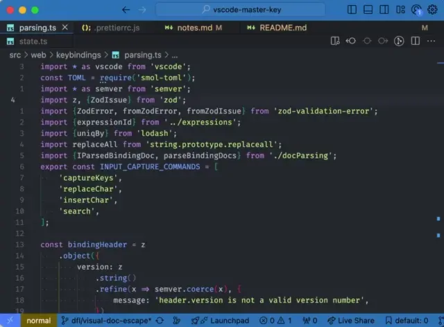

<h1>aster Key</h1>

[](https://www.repostatus.org/#active)
[](https://github.com/haberdashPI/vscode-master-key/actions/workflows/ci.yml)
[](https://codecov.io/gh/haberdashPI/vscode-master-key)
[](https://github.com/google/gts)

Master key helps you to learn, create and use powerful keybindings in [VSCode](https://code.visualstudio.com/).

If you want to improve your text editing super powers in VSCode, Master Key might just be the tool for you.

> [!NOTE]
> A message to power users: Master Key has been envisioned as a set of tools to make it easy to create powerful keybinding specifications for VSCode. While it currently only comes with a single binding set (used for daily work by @haberdashPI), it was built with the intent that additional binding sets (e.g. for a more Vim-like or Emacs-like experience) can be easily created. See the sections on [Keybinding Features](#keybinding-features) and [Customized Bindings](#customized-bindings) for more details.

## To get started

The easiest way to get started is to activate the built-in keybindings that come with Master Key.

1. Install this extension
2. Run the command `Master Key: Activate Keybindings`.
3. Select the built-in binding set "Larkin".

If at some point you decide you want to stop using Master Key, you can remove any bindings it added to your configuration by calling `Master Key: Deactivate Keybindings`.

## Examples

### Discoverability Features

#### Visual documentation of keybindings

Learn and review your bindings on a keyboard layout


#### Cheet sheet of keybindings

Review your bindings in a cheet sheet organized by theme


#### Keybinding hints

See a quick pick palette of possible bindings for the current mode and prefix of keys already pressed.


The example above shows the bindings available after pressing `m` in the Larkin keybinding
set that is included with Master Key.

### Editing Features

Here are some of the cool editing features that come with the built-in `Larkin` keybindings provided by Master Key with the help of [selection utilities](https://github.com/haberdashPI/vscode-selection-utilities). These bindings follow in the footsteps of Vim, Kakoune and Helix.

#### Move by Object

Select by word, line, paragraph and more.


Expand by indent, quotes and brackets.


Once you've selected the object, run commands to do stuff (e.g. delete/change/comment)

#### Multi-Cursor Creation and Filtering

Quickly create multiple selections, by splitting selections:


matching by word:


or using saved selections:


Filter out the ones you don't want, either by pattern:



or manual removal:


#### Exchange Objects

Swap selected objects with one another.


#### Repeat Last Selection / Action

Avoid lengthy key sequences by repeating the last action-related selection with "," and the last action with "."


#### Record Commands

Record longer command sequences and replay them.


> [!NOTE]
> Command recording comes with a few limitations. Master key can record any edits, and any commands that are issued through master key bindings. Commands that are not part of this binding file (e.g. a standard call to Cmd/Ctrl+V to paste) will not be recorded. You can copy your non-master-key bindings over to master key (so that they will be recorded) by [customizing your bindings](#customized-bindings) and using `Import Default Bindings` and `Import User Bindings` to allow all of the default and user bindings stored in VSCOde's normal keybinding files to be recorded by master key. (You will have to remove your original user bindings from the VSCOde `keybinding.json` file manually)

#### Symmetric Insert

Insert appropriate characters before and after each selection


### Keybinding Features

> [!WARNING]
> For the initial release of Master Key, the Keybinding Features are not yet well documented. You can review the features when copying Larkin to your own customization file. The main goal of the 0.3.0 release was to make the default keybindings accessible to new users. See the roadmap section below for details. The finer points of implementing your own keybindings will require some digging into source code and/or asking questions in the discussions section of this repo.

When you create your own keybindings using Master Key's special `.toml` keybinding format you get several powerful features that make it possible to easily create keybindings that would be difficult or impossible to implement without writing your own extension.

#### Modal Bindings

Your bindings can be modal—a special key (like escape) switches you to a different mode where all the keys on your keyboard can be used to issue commands specific to that mode.

```toml
[[bind]]
key = "j"
mode = "normal"
command = "cursorMove"
args.to = "down"
```

#### Parameteric Bindings

Express an entire series of bindings using the `foreach` field.

```toml
[[bind]]
path = "edit.count"
foreach.num = ['{key: [0-9]}']
name = "count {num}"
key = "{num}"
command = "master-key.updateCount"
args.value = "{num}"
```

#### Stateful Bindings

Update state with the `master-key.captureKeys`, `master-key.updateCount`, `master-key.setFlag` or `master-key.storeNamed` and then use this state in downstream commands using `computedArgs` instead of `args` in your keybinding.

```toml
[[bind]]
name = "between pair"
key = "m t"
description = """
Select between pairs of the same N characters
"""
command = "runCommands"

[[bind.args.commands]]
command = "master-key.captureKeys"
args.acceptAfter = 1

[[bind.args.commands]]
command = "selection-utilities.selectBetween"
computedArgs.str = "captured"
args.inclusive = false
```

#### Record and Repeat Commands

Master key records recent key presses, allowing you to create commands that quickly repeat a previous sequence using `master-key.replayFromHistory` or `master-key.pushHistoryToStack` and `master-key.replayFromStack`. You can disable key press recording by setting `master-key.maxCommandHistory` to 0 in your settings.

```toml
[[bind]]
key = ";"
name = "repeat motion"
repeat = "count"
command = "master-key.replayFromHistory"
args.at = "commandHistory[i].path.startsWith('edit.motion') && commandHistory[i].name != 'repeat motion'"
```

#### Documented Bindings

Of course, just like all of the built-in bindings in Master Key, you can document your bindings so that they show up legibly within the discoverability features above.
The toml file is a literate document used to generate the textual documentation
and all binding's names will show up in the visual documentation as appropriate.

## Customized Bindings

Okay, so you want to customize your keybindings, or create a whole new preset?

You can start by reviewing the built-in `Larkin` preset using the command `Master Key: Edit Preset Copy`. A new `*.toml` file with the contents of this master-key binding set will be opened. The file has comments throughout which document its use.

> [!WARNING]
> Because the error reporting for master keybinding files is not yet very precise, it is recommended that you edit bindings incrementally (e.g. by slowly creating new bundings or by slowly uncommenting an entire binding set you have imported). In this way you can ensure that the changes you've made can be properly activated by Mater Key. Long-term, better error reporting for these binding files will be available.

To simply customize an existing preset, you can append additional bindings by activating user bindings: create a new toml file and enter the bindings you want to append. Then call `Master Key: Activate User Keybindings` on the toml file you just created. You can import existing user bindings, from `keyindings.json`, by calling `Master Key: Import User Keybindings`.

Alternatively you can define your own preset and import bindings from those you've already created in VSCode. Create a preset copy by calling `Master Key: Edit Preset Copy` and then call `Master Key: Import Default/User Keybindings` to add any existing bindings you have to your preset copy. Edit the bindings as desired and update your settings to use them by calling `Master Key: Activate Keybindings` at any time.

> [!NOTE]
> Normal VSCode User keybindings always take precedence over master keybindings. (It would be rude to have Master Key automatically insert bindings with higher priority than user specified customizations). Make sure you delete any user keybindings from your `keybindings.json` file after importing them into your master keybindings `.toml` file.

## Roadmap

For detailed notes on development, refer to `notes.md`.

- Release 0.1.0: relatively stable default keybindings
- Release 0.1.x: improved coverage/testing/stability of existing features
- Release 0.2.0: missing visual documentation features: markdown summary of bindings
- Release 0.2.x: improved performance/coverage/stability
- Initial publish to VSCode here: 0.3.0
- 0.3.x: improved code coverage, stability improvements
- Release 0.4.x: documentation of all keybinding commands. May introduce breaking changes to improve API clarity for these bindings.
- Release 0.4.y: more precise binding error report: use VSCode language server features to
  get detailed line and character error indicators for binding-file problems
- Release 0.4.z: source code documentation — may involve substantial refactor to improve legibility / clarity of code
- Release 1.0.0:
    - code should be legible
    - test coverage should be satisfactory
    - documentation should be largely complete
- Release 1.x: upwards and onwards...
  - support for more keyboard layouts for visual docs
  - search: `showCount` displays movement count overlaid with each highlight
  - additional keybinding sets: e.g. vim, emacs
  - API improvements for new editor sets
  - keybinding debug QOL features: show the binding that was run for a given key sequence
  - clipboard registers

## Related Work

Master Key follows in the footsteps of many other extensions:

- [VSCodeVim](https://github.com/VSCodeVim/Vim)
- [vscode-neovim](https://github.com/asvetliakov/vscode-neovim)
- [Awesome Emacs Keymap](https://github.com/whitphx/vscode-emacs-mcx)
- [Dance](https://github.com/71/dance)
- [ModalEdit](https://github.com/johtela/vscode-modaledit)
- [ModalKeys](https://github.com/haberdashPI/vscode-modal-keys)

And of course, there are many existing editors that Master Key draws inspiration from:

- [vim](https://www.vim.org/)
- [emacs](https://www.gnu.org/software/emacs/)
- [kakoune](https://github.com/mawww/kakoune)
- [helix](https://helix-editor.com/)

## Developer Notes

This repository was designed to be worked with in unix-like environments. No effort to
support development on Windows has been made. The setup relies on a working version of
`nvm` installed in bash and an npm version matching the version specified in `.nvmrc`. You
can satisfy this requirement by copying and running the following in bash.

```sh
curl -o- https://raw.githubusercontent.com/nvm-sh/nvm/v0.39.5/install.sh | bash # install nvm
export NVM_DIR="$([ -z "${XDG_CONFIG_HOME-}" ] && printf %s "${HOME}/.nvm" || printf %s "${XDG_CONFIG_HOME}/nvm")"
[ -s "$NVM_DIR/nvm.sh" ] && \. "$NVM_DIR/nvm.sh" # load nvm
nvm install # install npm version found in `.nvmrc`
```

You can then install all dependencies for this project as follows:

```sh
nvm use
npm ic
```
